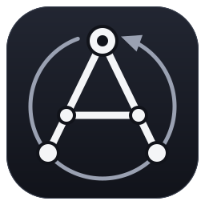

<p align="center">
  
</p>

# agency

Agent-related build skills for [Claude Code](https://code.claude.com).

## Install

```text
/plugin marketplace add anthropics/claude-plugins-community
/plugin install agency@claude-community
```

## Skills

### team-build

Leads an agent team through a build from a markdown plan, with explicit file ownership, contracts, and validation against real evidence. Confirms scope before starting and halts for review on anything unsafe, ambiguous, conflicting, or out of scope rather than guessing. It runs only when you invoke it.

```text
/agency:team-build <plan-path> [instruction]
```

- `plan-path` - path to a markdown file describing what to build. Omit it to resume an in-progress build from its `SESSION_STATE.md` record.
- `instruction` *(optional)* - a scope note, preference, or constraint for the run.

Example:

```text
/agency:team-build plans/auth-refactor.md "scope to the service layer; leave the client untouched"
```

### save-state

Saves the current work session to a `SESSION_STATE.md` record in the working directory, so it survives a context compression, a pause, or a fresh session. Invoke it when pausing, wrapping up, or before a likely compression. `team-build` calls it across long builds, but it stands alone too.

```text
/agency:save-state [context]
```

- `context` *(optional)* - extra detail to fold into the record, such as the in-flight thread or the last message before a compaction.

### resume-state

Resumes work from a saved `SESSION_STATE.md` record, verifying the recorded state against the actual files before acting, then reporting where things stand and continuing. Invoke it when picking up where a previous session left off. Like `save-state`, `team-build` calls it but it stands alone too.

```text
/agency:resume-state [context]
```

- `context` *(optional)* - extra detail to resume from alongside the record, such as the last message before a compaction.

More skills will be added to `agency` over time.

## Credits

`team-build` is based on [build-with-agent-team](https://github.com/coleam00/context-engineering-intro/tree/main/use-cases/build-with-agent-team) and its adjacent content, distributed under the MIT License.
